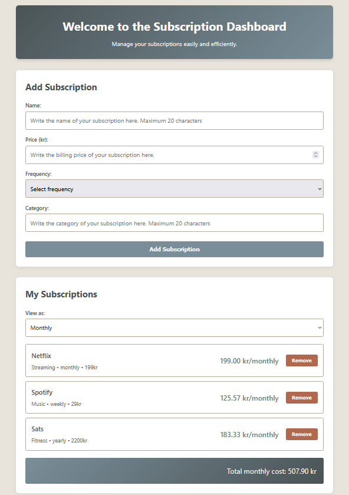

# Subscription Dashboard

⚠️ **Disclaimer:** This is a student project built for a school assignment focusing on Clean Code principles. 

A web application for managing and visualizing personal subscriptions. Get a clear overview of your recurring costs, identify unused services, and take control of your subscription spending. Using the [@hr222sy/subscription-tracker](https://www.npmjs.com/package/@hr222sy/subscription-tracker) module.

## Core Features

- ✅ **Add and manage subscriptions** - Track name, price, frequency, and category
- ✅ **Remove subscriptions** - Delete subscriptions you no longer need
- ✅ **Frequency toggle** - View costs in weekly, monthly, or yearly
- ✅ **Automatic cost conversion** - See how subscriptions add up over different timeframes
- ✅ **Real-time total calculation** - Always know your total recurring costs
- ✅ **Secure validation** - Input validation and sanitization on frontend and backend
- ✅ **Rate limiting** - Protection against abuse (100 req/min)

## Purpose

**For End Users:**  
Subscription Dashboard helps individuals take control of their subscription spending by providing a central hub for all recurring costs. In a world where the average person has 10+ subscriptions, it's easy to lose track of monthly expenses.

**For Developers & Students:**   
This project serves as a practical example of applying Clean Code principles and object-oriented design in a full-stack web application. It demonstrates the integration and use of a custom npm module in a real application context.

**For Educators:**  
Created as part of the 1dv610 course at Linnaeus University. The project focuses on learning and applying code quality principles, maintainability and software design patterns.


## Screenshots


*Main dashboard showing all subscriptions and total monthly cost*


## Links

- 📦 [npm module: @hr222sy/subscription-tracker](https://www.npmjs.com/package/@hr222sy/subscription-tracker)
- 🐙 [GitHub repository](https://github.com/HannaRV/subscription-dashboard)

## Table of Contents
- [Core Features](#core-features)
- [Purpose](#purpose)
- [Screenshots](#screenshots)
- [Links](#links)
- [Installation](#installation)
- [Usage](#usage)
- [Known Limitations](#known-limitations-mvp)
- [Technologies](#technologies)
- [Security](#security)
- [Project Structure](#project-structure)
- [For Developers](#for-developers)
- [License](#license)
- [Author](#author)
- [Academic Context](#academic-context)


## Installation

### Prerequisites
- **Node.js** ≥20.6.0
- **npm** ≥10.0.0
- **Browser:** Modern browser with ES6+ support

### Setup

1. **Clone the repository:**
```bash
git clone https://github.com/HannaRV/subscription-dashboard.git
cd subscription-dashboard
```

2. **Install dependencies:**
```bash
npm install
```

3. **Start the server:**
```bash
npm start
```

4. **Open browser:**
```
http://localhost:3000
```

## Usage

### Add a Subscription
1. Fill in subscription details:
   - **Name** (max 20 characters)
   - **Price** (SEK, 0 or positive number)
   - **Frequency** (weekly/monthly/yearly)
   - **Category** (max 20 characters)
2. Click "Add Subscription"
3. Subscription appears in the list

### Remove a Subscription
1. Find the subscription in your list
2. Click "Remove" button
3. Subscription is deleted immediately

### Toggle Frequency View
1. Use the "View as:" dropdown
2. Select weekly, monthly, or yearly
3. All subscriptions and total cost convert automatically
4. Original billing frequency is always shown

### View Total Cost
- Total cost displays at the bottom
- Updates automatically based on selected frequency
- Includes all active subscriptions

## Known Limitations (MVP)

⚠️ **Current version limitations:**

- **No data persistence** - Data is stored in memory only. Reloading the page clears all subscriptions.
- **No edit functionality** - To modify a subscription, you must delete and re-add it.
- **No usage analytics** - UsageAnalyzer from the module is not implemented in this MVP.
- **No category grouping** - Subscriptions are not grouped by category.

**Planned for future versions:**
- LocalStorage for session persistence
- Edit subscription functionality
- Usage tracking (cost per hour)
- Category breakdown with charts
- Backend database with user accounts

## Technologies

### Backend
- **Node.js (≥20.6.0)** - Runtime environment
- **Express 5** - Web framework
- **@hr222sy/subscription-tracker (v1.0.0)** - Custom npm module for subscription logic
- **helmet** - Security headers
- **express-rate-limit** - Rate limiting

### Frontend
- **Vanilla JavaScript (ES6+)** - No frameworks
- **HTML5** - Semantic markup
- **CSS3** - Styling

## Security

The application implements multiple security layers:

- ✅ **Helmet** - Security headers (CSP, HSTS, X-Frame-Options, etc.)
- ✅ **Rate Limiting** - 100 requests per minute per IP
- ✅ **Input Validation** - Frontend (HTML5) + Backend (middleware) validation
- ✅ **Error Handling** - Centralized error handling with proper responses
- ✅ **URL Encoding** - Safe handling of subscription names

## Project Structure
```
subscription-dashboard/
├── src/                    # Backend application code
│   ├── server.js           # Entry point
│   ├── controllers/        # Request handlers
│   ├── models/             # Data access layer
│   ├── routes/             # API routes
│   ├── middleware/         # Validation, security, error handling
│   └── views/              # HTML templates
├── public/                 # Frontend assets (CSS, JS)
├── docs/                   # Documentation
└── package.json
```

## For Developers

**Want to understand the codebase or contribute?**

See the **[Developer Guide](docs/DEVELOPER.md)** for:
- Detailed architecture documentation
- Design pattern explanations
- How to add new features
- Code organization guidelines

**Available Scripts:**
```bash
npm start     # Start production server
npm run dev   # Start development server with auto-reload
```

## License

MIT

## Author

**Hanna Rubio Vretby**  
📧 hr222sy@student.lnu.se  
🎓 Linnaeus University

---

## Academic Context

This project was created as part of **Laboration 3 (L3)** in course **1dv610** at Linnaeus University, focusing on:
- Clean Code principles (Robert C. Martin)
- Object-oriented programming
- Software design patterns
- Code quality and maintainability