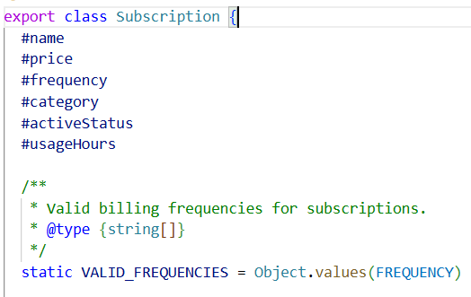
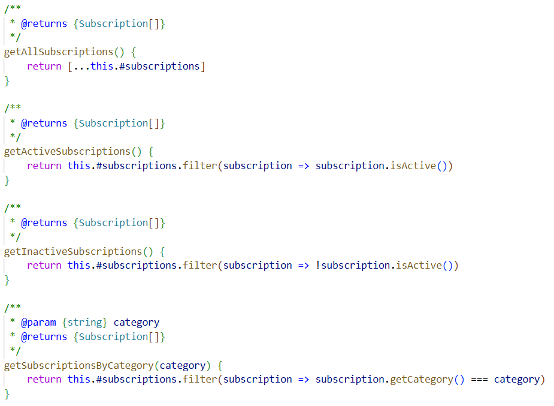
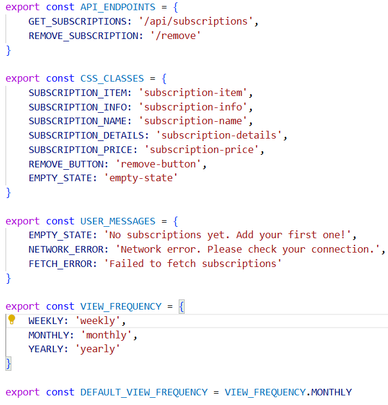
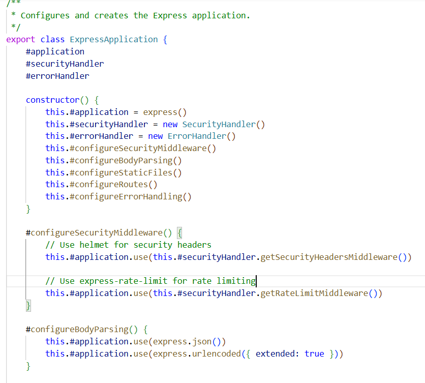

# Reflektion - Subscription Dashboard

**Namn:** Hanna Rubio Vretby  
**Användarnamn:** hr222sy  
**Kurs:** 1dv610  
**Projekt:** Subscription Dashboard  

## Intro
Denna reflektion täcker två kodbaser: npm-modulen @hr222sy/subscription-tracker (business logic, domain objects) och webbapplikationen Subscription Dashboard (presentation layer, använder modulen). Vissa designval skiljer sig mellan dem 
där modulen prioriterar API-stabilitet och återanvändbarhet medan appen prioriterar pragmatisk enkelhet för MVP-scope.

## Kapitel 2: Meaningful Names
Både modulen och applikationen följer Clean Codes namngivningsprinciper konsekvent med substantivnamn för klasser och verbnamn för metoder. Solution domain names används från etablerade patterns, appens 'Controller' och 'Repository' liksom modulens 'Collection' och 'Calculator' gör koden begriplig för utvecklare. Constants används genomgående för searchable names (WEEKS_PER_YEAR, HTTP_STATUS.BAD_REQUEST, VALID_FREQUENCIES) istället för magic numbers i båda projekten. I appens SubscriptionRepository uppstår en trade-off med getAllSubscriptionsAsPlainObjects() där namnet avslöjar returtypen (plain objects för JSON-serialisering) vilket bryter mot information Hiding. Skadan är dock begränsad då implementations detaljerna förblir dolda. Jag prioriterade meaningful distinction här mot modulens redan befintliga getAllSubscriptions() som returnerar domain objects där samma namn hade varit disinformation.

### Screenshots

## Kapitel 3: Functions
Funktioner är genomgående små och gör en sak enligt ”Do One Thing"-principen. ExpressApplication visar 'One Level of Abstraction' där constructor delegerar till private methods (#configureRoutes(), 
#configureSecurityMiddleware()) vilket håller abstraktionsnivån konsekvent, medan SubscriptionFieldValidator visar decomposition med varje validering i egen metod. Argumenten hålls ner med mest 0-2 argument vilket följer bokens rekommendation att minimera "conceptual power" som 
argument kräver. Command Query Separation följs konsekvent genom koden förutom i removeSubscription() som både tar bort och returnerar boolean. Detta är en medveten trade-off där jag valde användarvänlighet över strikt CQS då "subscription not found" är expected business logic som bör hanteras enkelt utan try-catch. Alternativet att kasta exception hade följt CQS men gjort API:et svårare att använda i vanliga scenarion.

### Screenshots

## Kapitel 4: Comments
Jag har strävat efter att hålla koden så självdokumenterande som möjligt för att minska behovet av kommentarer. Min kommentarstrategi följer "Explain Yourself in Code" genom att dokumentera vad läsaren behöver veta, exempelvis parametrarnas struktur när den inte är självklar (req.body: { name, price, frequency, category }) men inte standardparametrar som målgruppen känner till. Constants får förklarande kommentarer när det är motiverat (HOURS_PER_MONTH = 30.44 // Average month length) vilket följer "Informative Comments" för icke-uppenbara värden. En medveten trade-off är att undvika redundant JSDoc som bara upprepar metodnamn (validateSubscription() behöver inte "Validates subscription") samtidigt som JSDoc ger IntelliSense och type hints. Detta balanserar bokens ideal om self-documenting code mot praktisk nytta av developer tools för API-kontrakt. Jag upplever att det har varit svårt att hålla mig konsekvent i dokumentations nivån genom all kod och jobbat aktivt med detta.

### Screenshots

## Kapitel 5: Formatting
I modulen och appens backend-filer följer jag Clean Codes princip om små filer (typiskt < 200 rader) med newspaper structure där kod läses från hög till låg abstraktion, och "caller above callee" tillämpas där private helpers placeras direkt efter metoden som anropar dem. Vertical openness separerar koncept medan nära relaterad kod grupperas tillsammans. I frontend har jag dock main.js som är på 262 rader vilket överskrider rekommendationen, men där varje klass är individuellt liten och tillsammans bildar en cohesive modul. En trade-off där jag prioriterade pragmatisk enkelhet (alla frontend-klasser tillsammans utan imports) över att strikt följa rekommendationen, vilket underlättar utveckling och förståelse av frontend-flödet som helhet.

### Screenshots

## Kapitel 6: Objects and Data Structures
Koden separerar strikt mellan objects (private data + methods) och data structures (public data, no methods) utan hybrids enligt bokens "Object/Data Structure Anti-Symmetry". getAllSubscriptionsAsPlainObjects() visar boundary-transformation där Subscription-objekt konverteras explicit till plain objects eftersom privata fält inte serialiseras automatiskt och frontend inte behöver objektets beteende. Clean Code rekommenderar att använda data structures för data transfer. Ett alternativ hade varit toJSON() i Subscription-klassen för att behålla objekt-tänket hela vägen, men explicit konvertering i Repository gör boundary-transformationen tydligare och håller domain-objektet oberoende av serialization concerns. Repositorys transformation anropar flera getters på Subscription (getName(), getPrice(), getFrequency(), getCategory()) vilket tekniskt bryter Law of Demeter, men är motiverat då Repository fungerar som adapter vars ansvar är att översätta mellan modulens domain objects och appens data structures. Controller däremot pratar endast med Repository och undviker train wrecks genom att aldrig direkt accessa Subscription-objekt, vilket följer Law of Demeter på applikationsnivå.

### Screenshots

## Kapitel 7: Error Handling
Jag använder exceptions konsekvent genom koden istället för return codes vilket separerar felhantering från business logic, med en centraliserad ErrorHandler som delegerar till Logger, Classifier och Responder. ErrorClassifier använder keyword-matching för att klassificera modulens standard Error-objekt. Det är en medveten trade-off där custom error classes hade gett type-safety men brutit mot boundary-principen genom att exponera module internals och skapa tight coupling mellan modul och app. Keyword-matching är fragilt men pragmatiskt för detta MVP där modulens felmeddelanden är stabila och projekttiden begränsad. Alternativet re-wrapping hade behållit loose coupling men krävt mer utvecklingstid och tillfört komplexitet. Constructor validation säkerställer fail-fast där objekt aldrig kan vara i ogiltigt tillstånd och inga null-returns används, metoder returnerar tomma arrays eller kastar exceptions enligt Clean Code.

### Screenshots

## Kapitel 8: Boundaries
SubscriptionRepository isolerar npm-modulen där Controller inte känner till Subscription-klassen utan använder repositorys interface med appens vocabulär, vilket följer Clean Code:s "raise abstraction level by defining your own interface". SecurityHandler wrapprar helmet och express-rate-limit för centraliserad säkerhetskonfiguration och utbytbarhet vid ändringar i bibliotek. En central trade-off är Controllers tight coupling till Express (req, res, next). Wrapping hade gett bättre isolation men för MVP har jag valt denna approach då Express är stabilt, sällan ändras och cost/benefit-ratio inte motiverar den extra abstraktionen här. Frontend minimerar external beroenden genom fetch API.

### Screenshots

## Kapitel 9: Unit Tests
Modulen testas via test-app där varje test-sektion har expected behavioral-beskrivningar följt av console output för manuell verifiering, vilket följer Clean Codes princip om descriptive test names och self-documenting tests, medan appen testas via testspecifikation och testrapport med UI-testning. F.I.R.S.T-principerna följs där testerna är Fast, Independent, Repeatable och Timely (skrivna under utveckling), men Self-Validating kräver manuell jämförelse av output mot expected behavioral istället för automatiska assertions. En medveten trade-off var manuell testning istället för automatiserat framework som hade gett Self-Validating genom boolean assertions, men för MVP med tidsbegränsning var denna approach mer pragmatisk. Testerna täcker normal flow, edge cases och error handling med descriptive error messages.

### Screenshots

## Kapitel 10: Classes
Alla klasser följer SRP där varje klass har ett ansvarsområde och en reason to change, ErrorHandler delegerar till Logger, Classifier och Responder istället för att bära allt ansvar internt. Klasserna visar hög cohesion där metoder konsekvent använder instance variables (activate/deactivate/isActive använder #activeStatus, Repository-metoder använder #collection). En trade-off är användningen av static där modulen använder publika static konstanter som del av API:et för att undvika magic numbers även för användare, medan appens privata konstanter inte använder static enligt KISS-principen då jag tyckte att tydligare kod vägde tyngre här än teoretisk minnesoptimering. Klasser designas enligt Open/Closed Principle där Repository använder map 
(#frequencyCalculators) istället för switch statements för frequency-hantering och SubscriptionElementFactory encapsulerar DOM-creation, vilket gör att ny funktionalitet kan läggas till utan att modifiera existerande kod. Class organization följer Clean Code med member variables först, constructor, public methods och private methods sist vilket skapar konsistent läsbarhet genom kodbasen. Systemet är "organized for change" på klassnivå där varje klass har ett tydligt ansvar och ändringar isoleras till specifika klasser vilket minimerar ripple effects.

### Screenshots

## Kapitel 11: Systems
Applikationen separerar construction från use enligt "Separation of Main" där ExpressApplication koordinerar system-startup medan Controllers och Repository hanterar runtime-logik genom tre-lagers arkitektur (Presentation, Data Access, Domain) som kommunicerar via clean boundaries. SubscriptionRepository fungerar som adapter mellan Controller och npm-modul där Controller pratar appens språk utan att känna till modulens domain objects, vilket ger loose coupling och gör modulen återanvändbar oberoende av appens infrastruktur. Configuration management följer "keep configurable data at high levels" där domain layer exporterar delade konstanter (FREQUENCY), frontend-specifika grupperas i config.js (API_ENDPOINTS), och class-specifika hålls private (#VALIDATION_KEYWORDS). Cross-cutting concerns (security, error handling, validation) hanteras genom middleware vilket undviker kod-duplicering enligt DRY-principen. Dependency injection är en trade-off: backend använder constructor injection för loose coupling medan frontend använder direct instantiation för enkelhet. En approach motiverad av att backends lager-arkitektur behöver flexibilitet medan frontends cohesive klasser inte har alternativa implementationer vilket gör DI till över-engineering enligt YAGNI. Systemet är strukturerat för incremental growth där nya komponenter kan läggas till utan att påverka existerande kod.

### Screenshots

